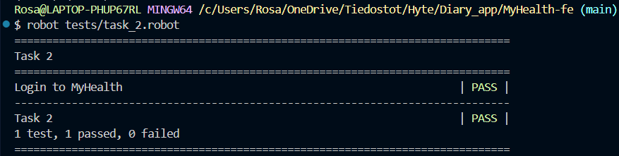
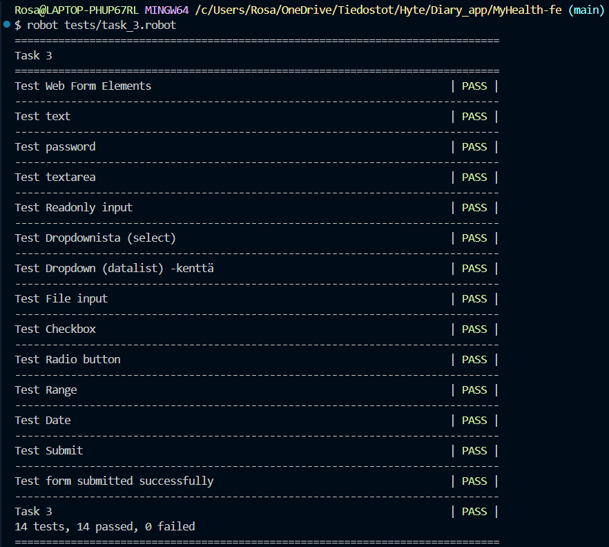
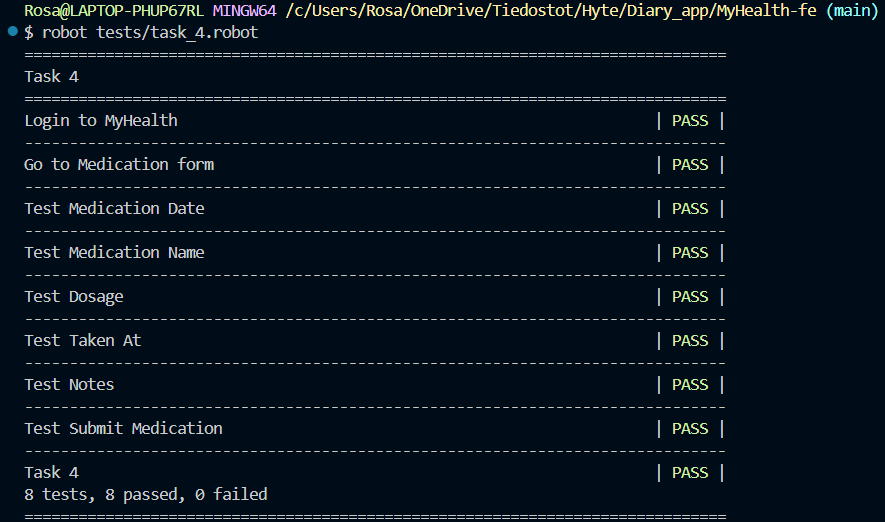
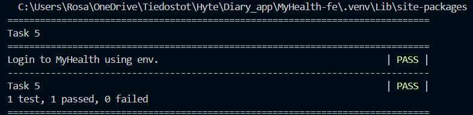
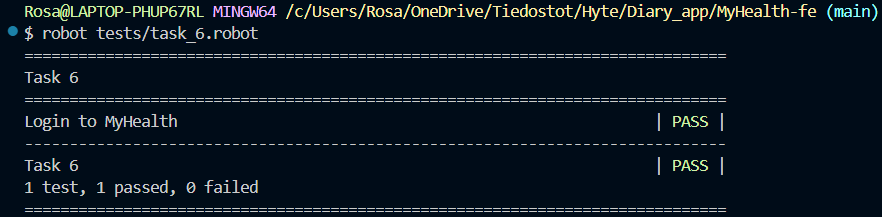

# Ohjemistotestaus - yksilötehtävät

## Tehtävä 1

Tässä tehtävässä tuli ladata Robot Framework ja siihen vaadittavat kirjastot:
- [Robot Framework](https://robotframework.org/)
- [Robot Framework Browser](https://robotframework-browser.org/)
- [Robot Framework Requests](https://marketsquare.github.io/robotframework-requests/doc/RequestsLibrary.html)
- [CryptoLibrary](https://pypi.org/project/robotframework-cryptolibrary/)
- [Robotidy](https://robotidy.readthedocs.io/)

## 1. Suoritetut Asennusvaiheet
Kaikki asennukseen liittyvät komennot suoritin VSCoden terminaalissa.

### 1.1 Pythonin asentaminen
Python oli jo asennettuna, version tarkistin komennolla:
```bash
python --version
```
Tulos: ***Python 3.13.1*** 

### 1.2 Virtuaaliympäristön luominen
Virtuaaliympäristön luonti ja aktivointi:

Tämän suoritin antamalla seuraavat komennot:
```bash
python -m venv venv
source .venv/Scripts/activate
```

Jotta virtuaaliympäristön tiedostot eivät kopioidu GitHub-kansioon, lisäsin .gitignore -tiedostoon seuraavan rivin:
```bash
.venv
```

Kun virtuaaliympäristö oli aktivoitu, tarkistin että python pakettien asentaja (pip), oli päivitetty viimmeisimpään versioon. Tämä tapahtui komennolla:
```bash
python -m pip install --upgrade pip
```
Tulos: ***Successfully installed pip-25.0.1*** 

### 1.3 Robot Frameworkin asennus
Seuraavaksi asensin Robot Frameworkin terminaalissa komennolla:
```bash
pip install robotframework
```
Tulos: ***Successfully installed robotframework-7.2.2*** 

Robot Framework asennuksen tarkistin vielä suorittamalla komennon:
```bash
robot --version
```
Tulos: ***Robot Framework 7.2.2*** 

### 1.4 Browser Libraryn asennus ja alustaminen
koska Browser library tarvitsee sekä Pythonin että Node.js toimiakseen. tarkistin Node.JS asennuksen komennolla:
```bash
node -v
```
Tulos: ***v22.13.0*** 

Browser library -kirjaston ja selainajurit asensin seuraavaksi antamalla komennon:
```bash
pip install robotframework-browser
```
Tulos: ***Successfully installed click-8.1.8 colorama-0.4.6 grpcio-1.70.0 grpcio-tools-1.70.0 natsort-8.4.0 overrides-7.7.0 protobuf-5.29.3 robotframework-assertion-engine-3.0.3 robotframework-browser-19.4.0 robotframework-pythonlibcore-4.4.1 seedir-0.5.0 setuptools-76.0.0 wrapt-1.17.2*** 

Kirjaston alustin komennolla:
```bash
rfbrowser init
```

### 1.5 Requests libraryn, Cryptolibraryn ja Robotidyn asennus
Tarvittavat kirjastot asensin komennoilla:
```bash
pip install robotframework-requests
pip install --upgrade robotframework-crypto
pip install robotidy
```
Tulos (robotframework-requests): ***Successfully installed certifi-2025.1.31 charset-normalizer-3.4.1 idna-3.10 requests-2.32.3 robotframework-requests-0.9.7 urllib3-2.3.0***

Tulos (--upgrade robotframework-crypto): ***Successfully installed PyNaCl-1.5.0 cffi-1.17.1 prompt_toolkit-3.0.50 pycparser-2.22 questionary-2.1.0 robotframework-crypto-0.4.2 wcwidth-0.2.13***

Tulos (robotidy): ***Successfully installed MarkupSafe-3.0.2 jinja2-3.1.6 markdown-it-py-3.0.0 mdurl-0.1.2 pathspec-0.12.1 pygments-2.19.1 rich-13.9.4 rich_click-1.8.5 robotframework-tidy-4.16.0 tomli-2.2.1 typing_extensions-4.12.2***

### 1.6 Asennuslistan tarkistus
Tarkistin asennuslistan listaamalla kaikki nykyisessä Python-ympäristössä asennetut paketit ja niiden versiot. Tämän suoritin antamalla komennon:
```bash
pip freeze
```
Tulos:
```bash
...
robotframework==7.2.2
robotframework-assertion-engine==3.0.3
robotframework-browser==19.4.0
robotframework-assertion-engine==3.0.3
robotframework-crypto==0.4.2
robotframework-pythonlibcore==4.4.1
robotframework-requests==0.9.7
robotframework-tidy==4.16.0
...
```

### 1.7 requirements.txt-asennuslistan luominen
Seuraavaksi ohjasin pip freeze-komennon luettelo tiedostoon käyttämällä uudelleenohjausta. Tämä tapahtui komennolla:

```bash
pip freeze > requirements.txt
```
Tämä loi requirements.txt-tiedoston, joka sisältää kaikki nykyisessä ympäristössä asennetut paketit ja niiden versiot. Tämän tiedoston avulla voi asentaa samat paketit toisessa ympäristössä käyttämällä seuraavaa komentoa:

```bash
pip install -r requirements.txt
```

### 1.8 Asennusten testaus
Seuraavaksi Kopioin opettajalta saadun asennustesti.py esimerkki tiedoston omaan projektiini kansioon tests ja ajoin se.

Tulos:
```bash
Python: 3.13.1 (tags/v3.13.1:0671451, Dec  3 2024, 19:06:28) [MSC v.1942 64 bit (AMD64)]
Robot Framework: 7.2.2
Browser: 19.4.0
requests: 2.32.3
CryptoLibrary: 0.4.2
```
--- 

## Tehtävä 2

Tässä tehtävässä tuli sovltaa opettajan antamaa esimerkkiä ja tehdä kirjautumistesti omalle terveyspäiväkirja-sovellukselle.

### Testikoodi:
Alla on tekemäni esimerkki kirjautumistestistä Robot Frameworkin ja Browser-kirjaston avulla:

#### **Muuttujat**
```robot
*** Variables ***
${Username}     Tähän käyttäjänimi
${Password}     Tähän salasana
```
**Loin tiedoston ```Keywords.robot``` jossa määrittelen testissä käytettävät muuttujat (kansio ei ole näkyvissä githubissa salassapidettävien tietojen vuoksi):** *käyttäjätunnus ja salasana.*

#### **Asetukset ja Testitapaus - testi ```task_2.robot``` tiedostossa**
```robot
*** Settings ***
Library    Browser    auto_closing_level=KEEP
Resource   Keywords.robot  

*** Test Cases ***
Login to MyHealth
    New Browser    chromium    headless=No
    New Page    http://localhost:5173/  

    # Klikkaa login-modal auki
    Click    id=openLoginModal
    Wait For Elements State    id=loginModal    visible

    # Kirjoita käyttäjätunnus ja salasana
    Type Text    css=#loginModal input[name="username"]    ${Username}    delay=0.1 s  
    Type Secret  css=#loginModal input[name="password"]    ${Password}    delay=0.1 s  

    # Klikkaa kirjautumispainiketta
    Click    css=#loginModal button.loginuser  
```
### Testin kuvaus:

**New Browser:** *Avaa uuden selaimen testin suoritusta varten.*

**New Page:** *Navigoi sovelluksen etusivulle.*

**Click:** *Klikkaa openLoginModal-elementtiä, joka avaa kirjautumisikkunan.*

**Wait For Elements State:** *Odottaa, että kirjautumisikkuna tulee näkyviin ennen seuraavien toimien suorittamista.*

**Type Text:** *Syöttää käyttäjätunnuksen ja salasanan.*

**Click:** *Klikkaa kirjautumispainiketta kirjautuakseen sisään.*

---

### Testin tulos:
Testi onnistui ja alla kuvakaappaus saamastani tuloksesta vs coden terminaalissa.



---

## Tehtävä 3

Tehtävänä oli tukia lisää Browser Libraryn käyttöä. Minun täytyi tehdä testi, joka testaa opettajan antamaa Web form -esimerkkisivun kenttien toimintaa (Dropdown (select), Dropdown (datalist), File input, Checkboxit, Radio buttonit, jne).

Linkki annettuun esimerkkisivustoon: **[Web form](https://www.selenium.dev/selenium/web/web-form.html)**

### Testikoodi - testi ```task_3.robot``` tiedostossa:

```robot
*** Settings ***
Library     Browser    auto_closing_level=KEEP
Test Setup    New Browser    chromium    headless=No

*** Test Cases ***
Test Web Form Elements
    New Page    https://www.selenium.dev/selenium/web/web-form.html

    # Varmista, että sivun otsikko on oikea
    ${title}=    Get Title
    Should Be Equal As Strings    ${title}    Web form

Test text
    Type Text    css=input[name="my-text"]    TestUser    delay=0.1 s 

Test password
    Type Text    css=input[name="my-password"]    salasana123    delay=0.1 s

Test textarea
    Type Text    css=textarea[name="my-textarea"]    This is a test message.    delay=0.1 s 

Test Readonly input
    Click    [name="my-readonly"]

Test Dropdownista (select)
    Select Options By    css=select[name="my-select"]    value    2    delay=0.1 s 

Test Dropdown (datalist) -kenttä
    Type Text    css=input[name="my-datalist"]    San Francisco    delay=0.1 s 

Test File input
    Upload File By Selector    input[type="file"]    ${CURDIR}/testfile.txt

Test Checkbox
    Check Checkbox    id=my-check-1
    Check Checkbox    id=my-check-2
    Get Checkbox State    id=my-check-1    ==    checked
    Get Checkbox State    id=my-check-2    ==    checked
    Uncheck Checkbox    id=my-check-2
    Get Checkbox State    id=my-check-2    ==    unchecked    delay=0.1 s 

Test Radio button
    Click    id=my-radio-2
    Get Element States    id=my-radio-2    contains    checked
    Click    id=my-radio-1
    Get Element States    id=my-radio-1    contains    checked
    Get Element States    id=my-radio-2    not contains    checked    delay=0.1 s

Test Range 
    Drag And Drop Relative to    [type="range"]    -100    0    steps=333 

Test Date
    Type Text    css=input[name="my-date"]    2025-03-24    delay=0.1 s

Test Submit
    Click    css=button 

Test form submitted successfully
    ${message}=    Get Text    css=#message
    Should Be Equal As Strings    ${message}    Received!
```
### Testin kuvaus:

**Test Web Form Elements:** *Testi avaa Web Form -esimerkkisivun ja tarkistaa, että sivun otsikko on oikein.*

**Test text:** *Täyttää tekstikentän, jossa on tavallinen tekstisisältö.*

**Test password:** *Syöttää salasanan kenttään.*

**Test textarea:** *Täyttää monirivisen tekstikentän.*

**Test Readonly input:** *Kokeilee lukittua kenttää.*

**Test Dropdownista (select):** *Valitsee vaihtoehdon pudotusvalikosta (select).*

**Test Dropdown (datalist) -kenttä:** *Syöttää arvon datalist-kenttään.*

**Test File input:** *Lataa tiedoston tiedostosyöttökenttään.*

**Test Checkbox:** *Valitsee ja poistaa valinnan valintaruutuista.*

**Test Radio button:** *Klikkaa radiopainikkeita ja tarkistaa niiden tilan.*

**Test Range:** *Siirtää liukusäädintä ja tarkistaa sen tilan.*

**Test Date:** *Syöttää päivämäärän kenttään.*

**Test Submit:** *Lähettää lomakkeen.*

**Test form submitted successfully:** *Varmistaa, että lomake on lähetetty onnistuneesti.*

---

### Testin tulos:
Testissä onnistuin testaamaan kaikkien kenttien toimintaa, paitsi värivalitsimen, johon käytin todella paljon aikaa ja erilaisia lähestymistapoja. onnistuin saamaan värivalitsimen kentästä kiinni ja avaamaan sen mutta väriä en saanut kentään vaihdettua. Alla kuvakaappaus onnistuneista tuloksista vs coden terminaalissa.



---

## Tehtävä 4

Tehtävänä oli tehdä testi, joka tekee uuden merkinnän omalle sovellukselleni. käytin testissä Lääkitysseurantaan tarkoitettua kentää. testissä kirjaudun ensin käyttäjällä sisälle ja siirryn lääkitystietojen lisäykseen MyHealth-sovelluksessa, tämän jälkeen syötän tiedot lääkitysseurantaan ja tallennan nämä.

### Testikoodi - testi ```task_4.robot``` tiedostossa:

```robot
*** Settings ***
Library    Browser    auto_closing_level=KEEP 
Resource   Keywords.robot

*** Test Cases ***

Login to MyHealth
    
    New Browser    chromium    headless=No
    New Page    http://localhost:5173/  

    # Klikkaa login-modal auki
    Click    id=openLoginModal
    Wait For Elements State    id=loginModal    visible

    # Kirjoita käyttäjätunnus ja salasana
    Type Text    css=#loginModal input[name="username"]    ${Username}    delay=0.1 s  
    Type Secret  css=#loginModal input[name="password"]    $Password      delay=0.1 s  

    # Klikkaa kirjautumispainiketta
    Click    css=#loginModal button.loginuser 

Go to Medication form
    Go To    http://localhost:5173/medication.html

Test Medication Date
    Type Text    css=input[id="date"]    28-03-2025    delay=0.1s

Test Medication Name
    Type Text    css=input[id="name"]    Kestox    delay=0.1s

Test Dosage
    Type Text    css=input[id="dosage"]    10mg    delay=0.1s

Test Taken At
    Type Text    css=input[id="taken_at"]    08:00    delay=0.1s

Test Notes
    Type Text    css=input[id="notes"]    For an allergic attack    delay=0.1s

Test Submit Medication
    Click    //button[text()='Add Medication']
    Sleep    2s  # Odotetaan tallennuksen varmistamiseksi
```
### Testin kuvaus:

**Login to MyHealth:** *Kirjautuu sisään MyHealth-sovellukseen käyttäen Keywords.robot tiedostossa määritettyjä tunnuksia.*

**Go to Medication form:** *Siirtyy lääkitystietojen syöttösivulle.*

**Test Medication Date:** *Täyttää lääkkeen määrämispäivämäärän kenttään.*

**Test Medication Name:** *Syöttää lääkkeen nimen.*

**Test Dosage:** *Syöttää lääkkeen annostuksen.*

**Test Taken At:** *Syöttää ajan, jolloin lääke otettiin.*

**Test Notes:** *Täyttää kentän lääkkeen käyttöön liittyvillä muistiinpanoilla.*

**Test Submit Medication:** *Lisää lääkitystiedot lomakkeeseen.*

---

### Testin tulos:
Testissä onnistuin kirjautumaan sisälle MyHealth-sovellukseeni ja siirtymään lääkinnän seuraukseen ja täälä syöttämään lääkkeen ja muut tarvittavat muuttujat sekä lisäämään nämä. Alla kuvakaappaus saamistani tuloksista vs coden terminaalissa.



---

## Tehtävä 5

Tehtävänä oli tehdä kirjautumistesti omalle Myhealth-sovellukselle, joka käyttää ’.env’-tiedostoon piilotettuja käyttäjätunnusta ja salasanaa.

### Luodaan tiedosto ```env.``` johon lisätään käyttäjänimi sekä salasana. Tiedosto ```gitignore.``` tiedostoon, jotta se ei tallennu GitHubiin.

```robot
*** Example  of env. file ***
USERNAME=Oma käyttäjänimi tähän 
PASSWORD=Oma salasana tähän 
```

### Määritellään muuttujat ```load_env.py``` tiedostossa:

```robot
import os
from dotenv import load_dotenv

load_dotenv()

USERNAME = os.getenv('USERNAME')
PASSWORD = os.getenv('PASSWORD')
```

### Testikoodi - testi ```task_5.robot``` tiedostossa:

```robot
*** Settings ***
Library    Browser    auto_closing_level=KEEP
Library           Collections
Library           OperatingSystem
Library           DotenvLibrary  # Lataa ympäristömuuttujat
Variables         load_env.py

*** Test Cases ***
Login to MyHealth using env.

    New Browser    chromium    headless=No
    New Page    http://localhost:5173/  

    ${USERNAME}=    Get Environment Variable    USERNAME
    ${PASSWORD}=    Get Environment Variable    PASSWORD

    [Documentation]
    Log    USERNAME: ${USERNAME}
    Log    PASSWORD:

    # Klikkaa login-modal auki
    Click    id=openLoginModal
    Wait For Elements State    id=loginModal    visible

    # Kirjoita käyttäjätunnus ja salasana
    Type Text    css=#loginModal input[name="username"]    ${USERNAME}    delay=0.1 s  
    Type Secret  css=#loginModal input[name="password"]    $PASSWORD    delay=0.1 s  

    # Klikkaa kirjautumispainiketta
    Click    css=#loginModal button.loginuser
```
### Testin kuvaus:

**New Browser:** *Avaa uuden selaimen testin suoritusta varten.*

**New Page:** *Navigoi sovelluksen etusivulle.*

**Get Environment Variable:** *Hakee käyttäjätunnuksen ja salasanan ympäristömuuttujista.*

**Log:** *Kirjaa käyttäjätunnuksen ja piilottaa salasanan testilokissa.*

**Click:** *Klikkaa openLoginModal-elementtiä, joka avaa kirjautumisikkunan.*

**Wait For Elements State:** *Odottaa, että kirjautumisikkuna tulee näkyviin ennen seuraavien toimien suorittamista.*

**Type Text:** *Syöttää käyttäjätunnuksen kirjautumiskenttään.*

**Type Secret:** *Syöttää salasanan kirjautumiskenttään turvallisesti ilman, että se näkyy testilokissa.*

**Click:** *Klikkaa kirjautumispainiketta kirjautuakseen sisään.*

---

### Testin tulos:
Testi onnistui ja alla kuvakaappaus saamastani tuloksesta vs coden terminaalissa.



---

## Tehtävä 6

Tehtävänä oli tehdä kirjautumistesti omalle Myhealth-sovellukselle, missä sekä salasana että käyttäjätunnus on kryptattu käyttäen CryptoLibrarya.

### Testikoodi - testi ```task_6.robot``` tiedostossa:

```robot
*** Settings ***
Library     Browser     	    auto_closing_level=SUITE
Library     CryptoLibrary     variable_decryption=True   #Kryptatut muuttujat puretaan automaattisesti

*** Variables ***
${Username}    crypt:Aaxk2uyVexr+5cDWn7qlr1hI1bnza2YVvBvdB9/AUhS19bNghpKEZ/4QqbLRc2dpEq3X8ZPY7yg=
${Password}    crypt:Wa07dhSDMUozeRABOSZHi2Nf4Geeds/HVFPQYgsG+DmR6Un6juu8pK6rx90m/wL25O/5/0PeQNr9SzuDEA== 

*** Test Cases ***
Login to MyHealth
    New Browser     chromium    headless=No
    New Page    http://localhost:5173/

    # Klikkaa login-modal auki
    Click    id=openLoginModal
    Wait For Elements State    id=loginModal    visible

    # Kirjoita käyttäjätunnus ja salasana
    Type Text    css=#loginModal input[name="username"]    ${Username}    delay=0.1 s  
    Type Secret  css=#loginModal input[name="password"]    $Password      delay=0.1 s  

    # Klikkaa kirjautumispainiketta
    Click    css=#loginModal button.loginuser
```
### Testin kuvaus:

**Variables:**

*Käyttäjätunnus ja salasana on tallennettu kryptattuina ja ne puretaan automaattisesti ennen käyttöä.*

**Testin kulku:**

**New Browser:** *Avaa uuden Chromium-selaimen ilman headless-tilaa.*

**New Page:** *Navigoi sovelluksen kirjautumissivulle (http://localhost:5173/).*

**Click:** *Klikkaa login-modal-elementtiä (id=openLoginModal), joka avaa kirjautumisikkunan.*

**Wait For Elements State:** *Varmistaa, että kirjautumisikkuna (id=loginModal) on näkyvissä ennen seuraavien toimien suorittamista.*

**Type Text:** *Syöttää puretun käyttäjätunnuksen kirjautumiskenttään.*

**Type Secret:** *Syöttää puretun salasanan turvallisesti ilman, että se näkyy testilokissa.*

**Click:** *Klikkaa kirjautumispainiketta kirjautuakseen sovellukseen.*

---

### Testin tulos:
Testi onnistui ja alla kuvakaappaus saamastani tuloksesta vs coden terminaalissa.



---

## Tehtävä 7

Tehtävänä oli ohjata testien loki- ja raporttitiedostot erilliseen outputs/-kansioon. 

**Aluksi loin erillisen *[outputs/](outputs/)* kansion projektiin, johon ohjasin testien loki- ja raporttitiedostot.**

**Ohjaus tapahtui antamalla terminaalissa komento: `robot --outputdir outputs tests/haluttu testi.robot` testiä suoritettaessa.**

---

## Tehtävä 8

Tehtävänä oli luoda omalle GitHub-kansiollesi github.io-sivusto jonka kautta testien loki- ja
raporttitiedostot (HTML) ovat luettavissa.

**Aluksi tein projektin juureen kansion nimeltä `docs/`. kansion loin terminaalissa komennolla:
```bash
mkdir docs
```
Seuraavaksi kopioin outputs kansioon ajetut *log.html* ja *reports.html* tulokset `docs/` kansioon antamalla terminaalissa komennot: 
```bash
cp outputs/log.html docs/
cp outputs/report.html docs/
```
Kopioinnin pystyi myös automatisoida. tämä tapahtuu lisäämällä terminaalissa suoritettavan testiajon loppuun rivin, joka kopioi *logit* `docs/`-kansioon automaattisesti:
```bash
robot --outputdir outputs tests/
cp outputs/log.html docs/
cp outputs/report.html docs/
```

Vaikka GitHub Pages osaa näyttää `docs/`-kansion sisällön suoraan, tein kuitenkin kyseiseen kansioon *index.html* tiedoston jotta tulosten käsittely ja lukeminen olisi selkeämpää.

Seuraavaksi menin GitHub-repositorioni sivulle selaimessa. Repositoriossa suoritin seuraavat vaiheet:

1. Valitsin Settings → Pages

2. Valitsin Kohdan "Source":
    - Tästä valitsin Branch: main
    - Jonka jälkeen valitsin /docs kansion

3. Lopuksi painoin Tallenna painiketta.

Hetken kuluttua suoritettuani toiminnot Githubissa sain osoitteen [🌐 Testisivun etusivu (index.html)](https://rosahaut.github.io/MyHealth_fe/) josta testien tulokset ovat nähtävillä selaimessa.
